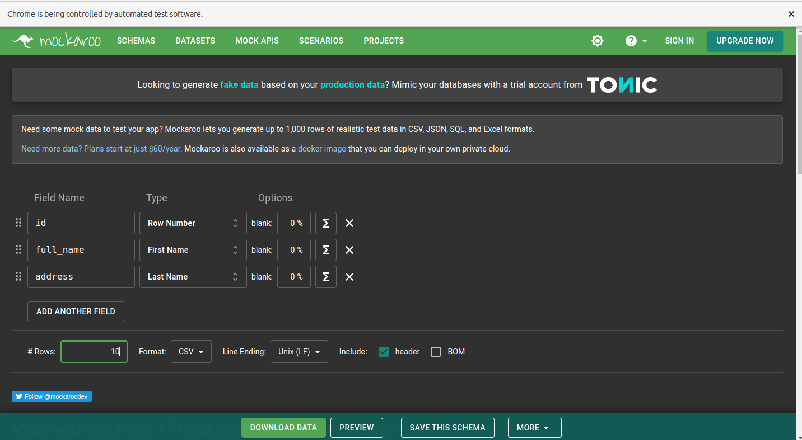

# :zap: Web Automation with Selenium & PyTest

* Web Automation Project using **Selenium** and **Pytest**


## :page_facing_up: Table of Contents

* [:zap: Python Django Crypto](#zap-python-django-crypto)
  * [:page_facing_up: Table of contents](#page_facing_up-table-of-contents)
  * [:books: General info](#books-general-info)
  * [:camera: Screenshots](#camera-screenshots)
  * [:signal_strength: Technologies](#signal_strength-technologies)
  * [:floppy_disk: Setup](#floppy_disk-setup)
  * [:computer: Code Examples](#computer-code-examples)
  * [:cool: Features](#cool-features)
  * [:clipboard: Status & To-do list](#clipboard-status--to-do-list)
  * [:clap: Inspiration](#clap-inspiration)
  * [:envelope: Contact](#envelope-contact)

## :books: General info

* This is a simple project that uses Selenium to access [Mockaroo] (https://www.mockaroo.com/) and downloads a customized Dataset


## :camera: Screenshots




## :signal_strength: Technologies

* [Python v3.9](https://www.python.org/)
* [Selenium v4.7.2](https://selenium-python.readthedocs.io/)
* [PyTest v7.2.0](https://docs.pytest.org/)


## :floppy_disk: Setup

* [Install Python](https://docs.python-guide.org/starting/installation/)
* [Install pip](https://docs.python-guide.org/dev/virtualenvs/#installing-pipenv)
* [Install Django](https://docs.djangoproject.com/en/3.1/howto/windows/) by typing `pip install Django`
* Run `django-admin startproject crypto_proj` to create a new project [ref. docs](https://docs.djangoproject.com/en/3.1/intro/tutorial01/)
* Open `crypto_proj` in VS Code
* Run `python manage.py startapp positions` to create Python module
* Add code
* Run `pip freeze` to see list of modules installed. [Ref. Docs](https://pip.pypa.io/en/stable/reference/pip_freeze/)
* Run `python manage.py makemigrations` for changes to models etc.
* Run `python manage.py migrate` to migrate the migration files.
* To add a superuser run `python manage.py createsuperuser --username=joe --email=joe@example.com` [Ref. Docs](https://docs.djangoproject.com/en/3.1/topics/auth/default/) and log into admin panel
* Run `python manage.py runserver` to run server on port 8000. A refresh is needed after any code changes

## :computer: Code Examples

* extract from - tba

```python

```

## :cool: Features

* Django inbuilt packages - admin dashboard

## :clipboard: Status & To-do list

* Status: Incomplete: paused at video 3 - 4.05 while I check Homebrew for Windows - video only shows Mac version
* To-do: check if chocolatey package manager can replace Homebrew which is not for Windows

## :clap: Inspiration

* [Pyplane: Youtube: Django real time application | django channels, celery, redis | part 1 - overview](https://www.youtube.com/watch?v=Ib8UwwnPYsE)
* [Pyplane: Youtube: Django real time application | django channels, celery, redis | part 2](https://www.youtube.com/watch?v=YQRg5Mrg1oY)
* [Pyplane: Youtube: Django real time application | django celery in practice | part 3](https://www.youtube.com/watch?v=DhscKT1t8Vs)
* [Pyplane: Youtube: Django real time application | django celery in practice | part 4](https://www.youtube.com/watch?v=wfVwApNPcHs)

## :file_folder: License

* N/A

## :envelope: Contact

* Repo created by [ABateman](https://github.com/AndrewJBateman), email: gomezbateman@yahoo.com